# CalenTask

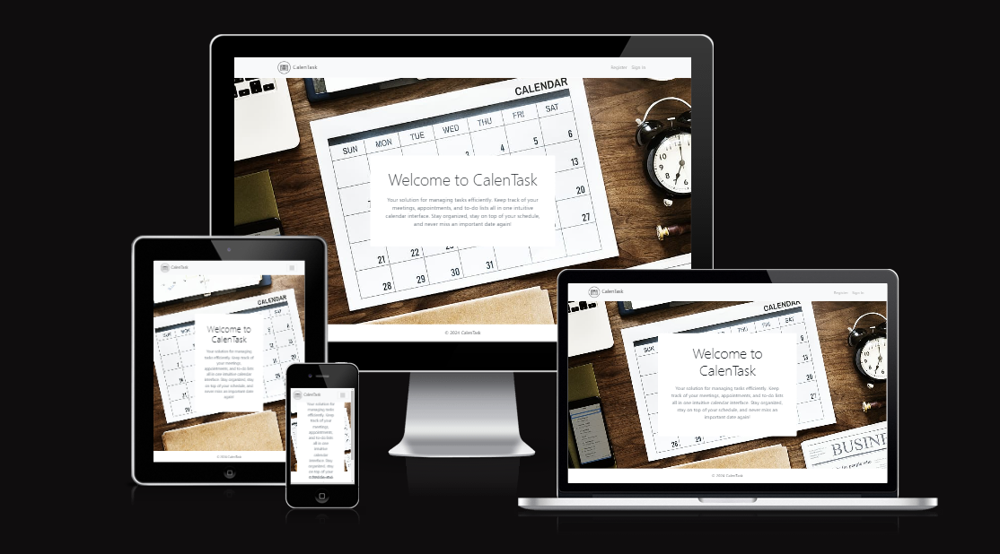

## Table of Contents

- [Introduction and Project Goals](#introduction-and-project-goals)
- [Wireframes](#wireframes)
- [Features](#features)
- [Technologies Used](#technologies-used)
- [Color Schemes](#color-schemes)
- [Fonts](#fonts)
- [React Components](#react-components)
- [Installation](#installation)
- [Configuration](#configuration)
- [Usage](#usage)
- [Acknowledgments](#acknowledgments)
- [Testing](#testing)
- [Pages](#pages)
- [Deployment](#deployment)
- [CONSTANT.js](#constantjs)
- [Future Functionalities](#future-functionalities)
  - [Logs](#logs)
- [Enhancing User Experience with React](#enhancing-user-experience-with-react)

## Introduction and Project Goals

CalenTask is a Task Management System designed to help users organize and track their tasks efficiently. It allows users to register, create tasks, assign them to other users, and monitor their progress through an intuitive calendar interface.

## Wireframes

### Home

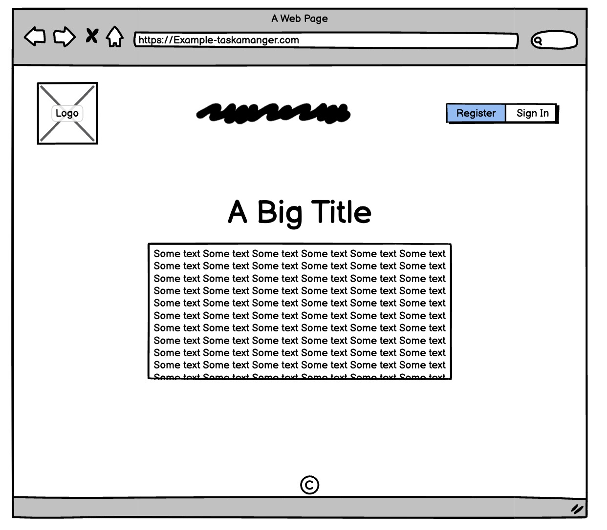 
Short description: Wireframe for the home page of CalenTask.

### Dashboard

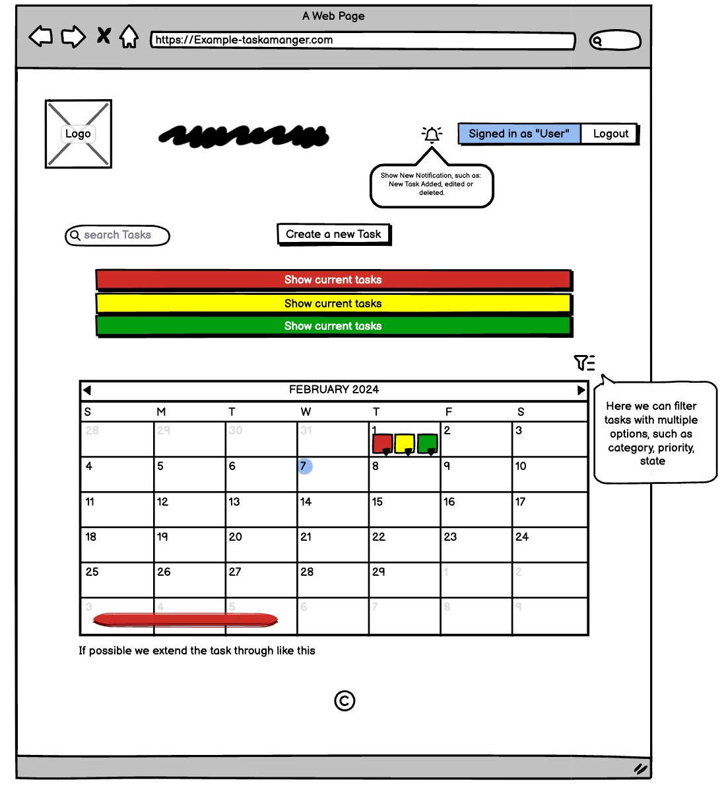 
Short description: Wireframe for the dashboard page of CalenTask, displaying a calendar view of tasks.

### Add New Task

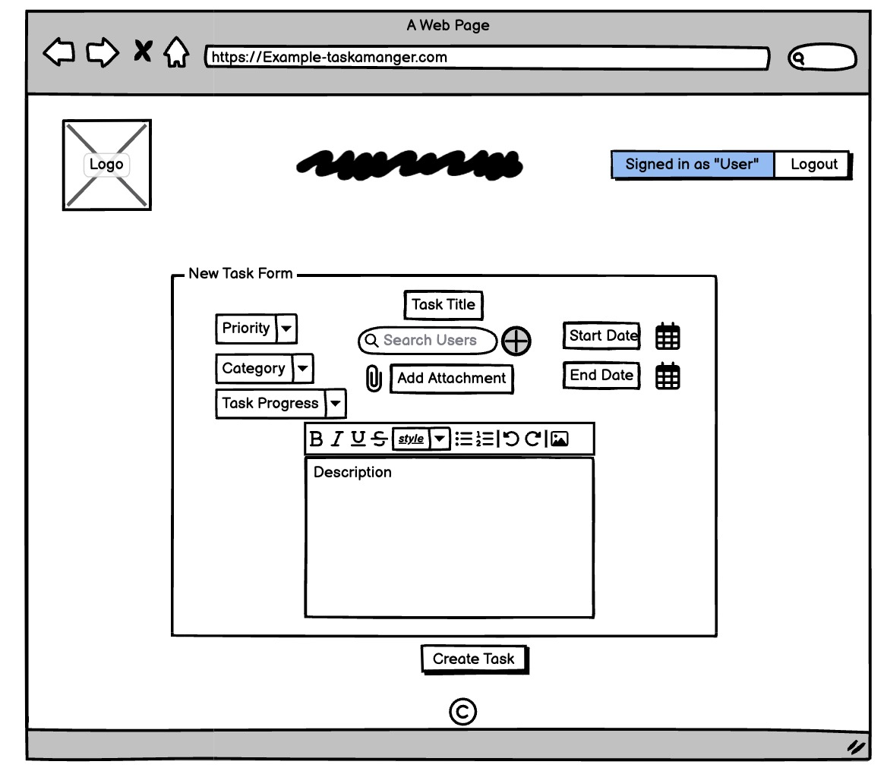 
Short description: Wireframe for the add new task page of CalenTask, allowing users to create a new task.

### Edit Task

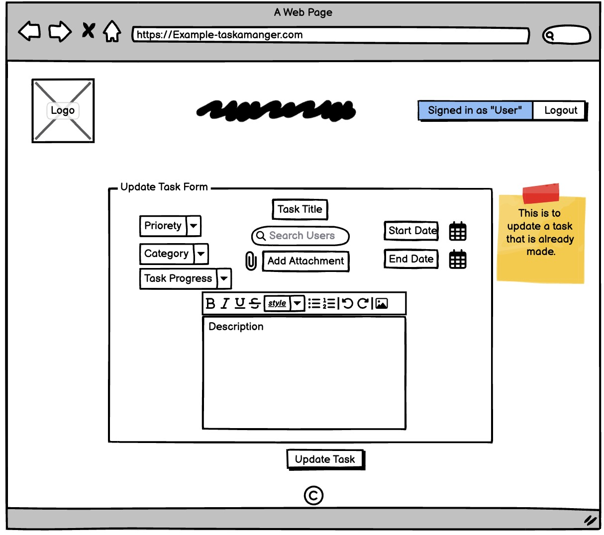 
Short description: Wireframe for the edit task page of CalenTask, enabling users to modify task details.

### View Task

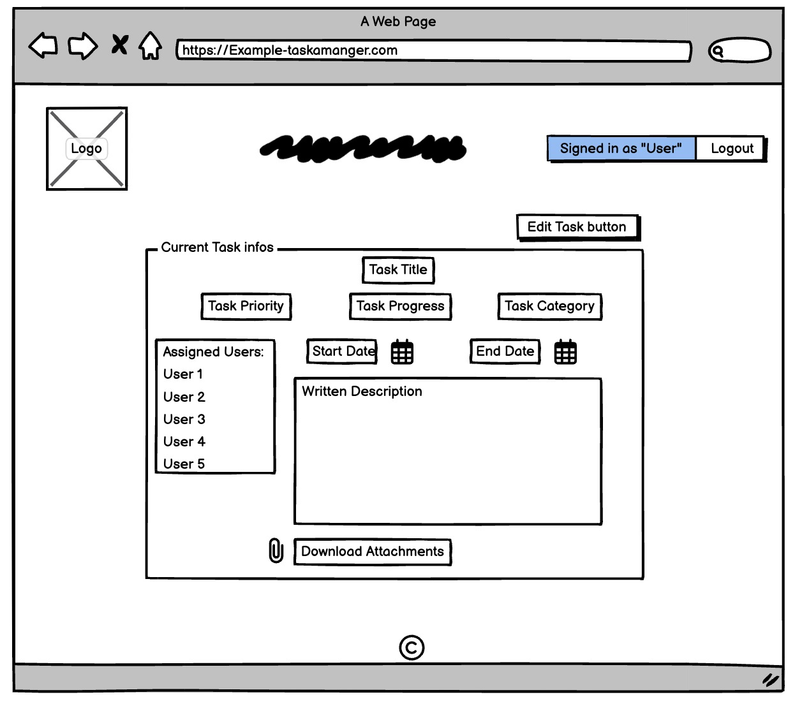 
Short description: Wireframe for the view task page of CalenTask, displaying detailed information about a task.

## Features

- **Task Management**: Create, edit, and delete tasks with ease.
- **Priority Levels**: Assign priority levels to tasks (Important, Medium, Low).
- **Categorization**: Categorize tasks for better organization.
- **Progress Tracking**: Monitor task progress (Open, In Progress, Done) at a glance.
- **Date Management**: Set start and end dates for tasks.
- **Attachments**: Attach files to tasks for additional context or reference.
- **Calendar View**: View tasks on a calendar, with options for daily, weekly, monthly, and agenda views.
- **User Assignment**: Assign tasks to other users for collaboration.

## Technologies Used

- **Backend**: Django (Python)

  - Reason: Django is a powerful and popular web framework that provides a robust backend infrastructure for building scalable and secure applications.

- **Frontend**: Bootstrap (HTML/CSS/JS), React (JavaScript)

  - Reason: Bootstrap is a widely-used CSS framework that offers a responsive and mobile-first design. React is a JavaScript library for building user interfaces, providing a component-based approach and efficient rendering.

- **Calendar Component**: [react-big-calendar](https://www.npmjs.com/package/react-big-calendar)

  - Reason: react-big-calendar is a feature-rich and customizable calendar component for React, which provides the necessary functionality for displaying and managing tasks in a calendar format.

- **Testing**: Placeholder for testing section
  - Reason: Testing is an essential part of software development to ensure the reliability and correctness of the application. Placeholder is used to indicate that the testing section is yet to be implemented.

## Color Schemes

The color schemes used in CalenTask are well thought out and contribute to a visually appealing user interface. The following color scheme is used:

- Body Text: #000000b3

In addition, the priority levels of tasks are visually represented using different background colors:

- Important: Red background with white text
- Medium: Yellow background with black text
- Low: Green background with white text

This color scheme effectively communicates the importance of tasks and helps users quickly identify their priority levels.

## Fonts

CalenTask utilizes the Roboto font, which is loaded using the Google Fonts API. The Roboto font is a popular choice for its clean and modern appearance, making it highly readable and suitable for both headings and body text. By using the Google Fonts API, the font is loaded efficiently and ensures consistent typography across different devices and browsers.

The combination of the Roboto font and the chosen color scheme creates a visually pleasing and user-friendly interface in CalenTask.

## React Components

### Reusable

1. **Footer**: A reusable component that displays the footer section of the application.

2. **Header**: A reusable component that displays the header section of the application.

### Auth

1. **Login**: A component that handles the login functionality, allowing users to authenticate and access their accounts.

2. **Register**: A component that handles the registration functionality, allowing new users to create an account.

### Contexts

1. **UserData**: A context component that holds user personal information and the isLoggedIn session information.

### Layouts

1. **Layout**: A layout component that provides a consistent structure for rendering views.

### Views

1. **Home**: A view component that serves as the landing page for the application.

2. **Dashboard**: A view component that allows users to search for and view tasks in a calendar format.

3. **AddNewTask**: A view component that enables users to create a new task by providing relevant details.

4. **ViewTasks**: A view component that displays detailed information about a specific task and provides options to update or delete it.

5. **EditTask**: A view component that allows users to modify the details of an existing task.

6. **Profile**: A view component that allows users to view and edit their personal information.

7. **NotFound**: A view component that is displayed when a requested page is not found.

## Installation

1. Clone the repository.
2. Before running the project, go to `CONSTANT.js` and update the URLs in the `CONSTANT` object.
3. Install backend dependencies using `pip install -r requirements.txt`.
4. Install frontend dependencies using `npm install`.
5. Start the development server for the backend using `python manage.py runserver`.
6. Start the development server for the frontend using `npm start`.

## Configuration

- Configure the database settings in `settings.py` according to your environment (e.g., PostgreSQL, MySQL).
- Customize frontend UI components in the `src/components` directory.
- Configure user authentication and permissions as needed.

## Usage

1. Register or login to your CalenTask account.
2. Create tasks by filling in the required fields and selecting options such as priority, category, and dates.
3. Assign tasks to other users if necessary.
4. View tasks on the calendar dashboard and navigate between different views (daily, weekly, monthly, agenda).
5. Click on a task to view more details or to edit/delete it (only available to the task owner).
6. Monitor task progress and update as necessary.

## Acknowledgments

- Inspiration from wireframes and Bootstrap UI.
- React Big Calendar npm package for calendar functionality.
- Copilot for code suggestions and inspiration.

## Testing

### Lighthouse Testing

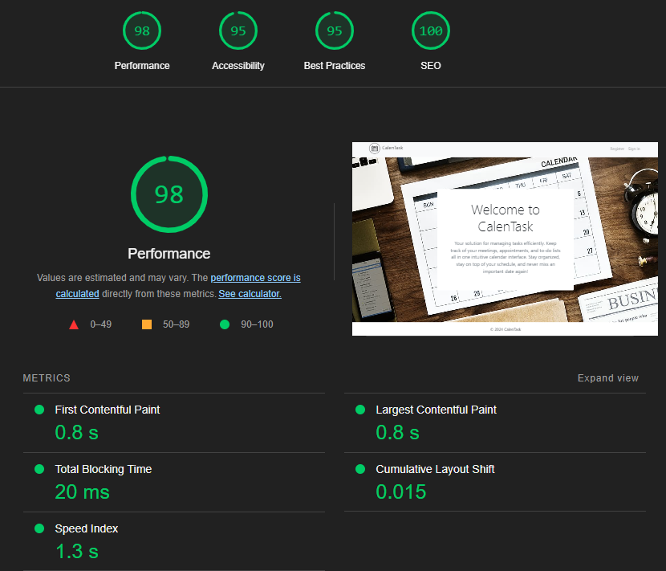

- Description: Lighthouse is an open-source tool for auditing and improving the quality of web pages. It measures performance, accessibility, best practices, and SEO of a web application. The screenshot above shows the results of Lighthouse testing for CalenTask.

### Manual Testing

- 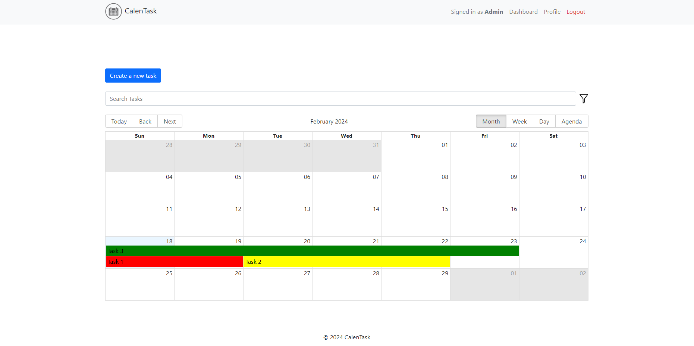 _Calendar View showing tasks for the month._

- 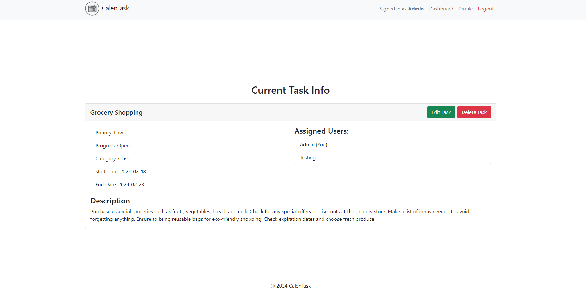 _Task Details page displaying task information._

- 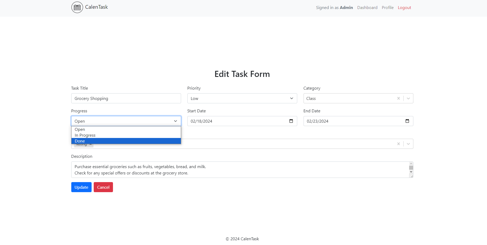 _Edit Task page allowing users to modify task details._

## Pages

### Home Page

- Screenshot: 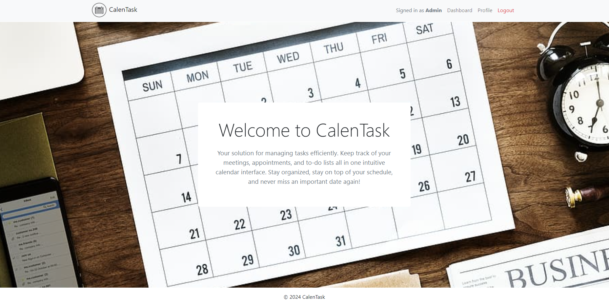
- Description: The Home page serves as the landing page for CalenTask. It provides an overview of the application and may include login/register options.

### Dashboard Page

- Screenshot: 
- Description: The Dashboard page displays a calendar view of tasks, allowing users to visualize their tasks over different time periods (daily, weekly, monthly).

### Profile Page

- Screenshot: 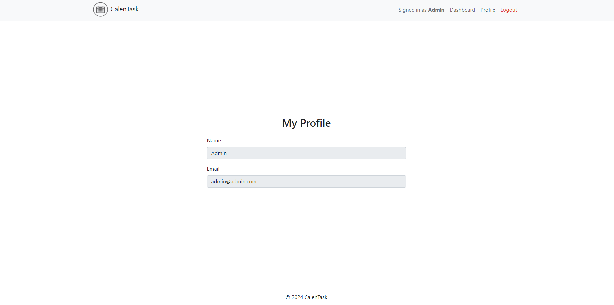
- Description: The Profile page allows users to view and edit their personal information, such as username, email, and profile picture.

### Add New Task Page

- Screenshot: 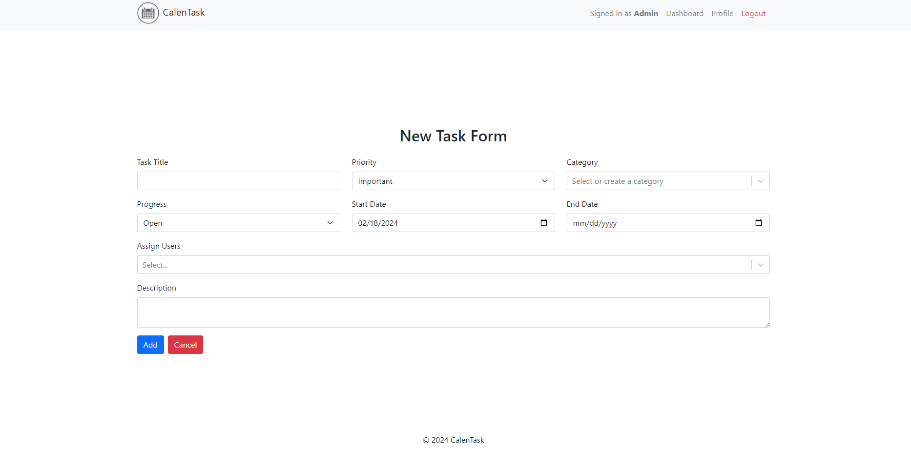
- Description: The Add New Task page enables users to create a new task by providing details such as title, priority, category, start/end dates, and attachments.

### Edit Task Page

- Screenshot: 
- Description: The Edit Task page allows users to modify the details of an existing task, including title, priority, category, dates, and attachments.

### View Task Page

- Screenshot: 
- Description: The View Task page displays detailed information about a specific task, including its title, description, priority, category, dates, and attachments.

## Deployment

CalenTask is deployed on Heroku using Node.js. As React has static files, the "serve" package is used.

1. Create a Heroku account and install the Heroku CLI.
2. Initialize a Git repository in your CalenTask project folder (`git init`).
3. Log in to Heroku CLI (`heroku login`) and create a new Heroku app (`heroku create`).
4. Set up Heroku PostgreSQL as the database (`heroku addons:create heroku-postgresql`).
5. Push your code to the Heroku remote (`git push heroku master`).
6. Run migrations and set up the database (`heroku run python manage.py migrate`).
7. Install the "serve" package (`npm install serve`).
8. Add a start script to your `package.json` file: `"start": "serve -s build"`.
9. Build your React app (`npm run build`).
10. Deploy your app to Heroku (`git push heroku master`).
11. Your CalenTask application should now be deployed and accessible via the provided Heroku app URL.
12. Your app should now be deployed and accessible via the provided Heroku URL.

## Future Functionalities

### Logs

In the current implementation, the system saves logs for the creation, updation, and deletion of tasks. However, there is no interaction functionality for users to view these logs or receive notifications.

A future functionality to be added is the ability for users to interact with the logs. This can include features such as:

- Viewing a log history for each task, displaying the date and time of each action.
- Notifying users when a task they are assigned to has been modified or deleted.
- Providing a notification center where users can view all their notifications.

Implementing these functionalities will enhance the user experience and improve the overall usability of the CalenTask Task Management System.

## Enhancing User Experience with React

### 1. Improved Performance

By leveraging React's virtual DOM, our application achieves remarkable performance enhancements. React efficiently updates only the components that have changed, resulting in faster rendering times and a smoother user interface experience. Users will notice a significant reduction in page load times, especially when interacting with dynamic content.

### 2. Enhanced Interactivity

React's component-based architecture facilitates the creation of highly interactive user interfaces. Through the use of reusable components, we've implemented seamless navigation, intuitive user interactions, and dynamic data updates. This enhances user engagement and provides a more enjoyable experience while navigating through our application.

### 3. Responsive Design

With React's responsive design capabilities, our application adapts seamlessly to various screen sizes and devices. Whether users access the application on desktops, tablets, or mobile devices, they'll experience consistent functionality and visual appeal. This ensures optimal usability and accessibility across different platforms, contributing to an improved overall user experience.

### 4. Streamlined Development Workflow

The declarative nature of React simplifies the development process, allowing us to focus more on building features and less on managing state and DOM manipulation. This streamlined workflow results in faster iterations, quicker bug fixes, and ultimately, a more polished end product. Users benefit from a more stable and reliable application, leading to increased satisfaction and retention.

### Conclusion

In conclusion, the integration of React has been instrumental in enhancing the user experience within our application. From improved performance and enhanced interactivity to responsive design and streamlined development, React's features have contributed to a more engaging, efficient, and user-friendly experience for our audience.

Thank you for exploring our project documentation. We hope you enjoy using our application!
